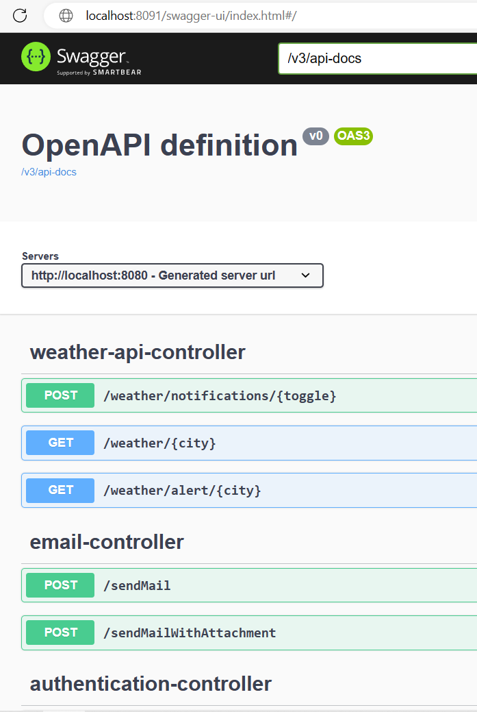

# Harvest Helper
Web service designed to simplify the work of agricultural workers by
providing a weather forecast followed by data analysis and providing
advice on agricultural work.

## Features(backend)
* REST API service
* User registration and login with JWT authentication
* Password encryption using BCrypt
* Role-based authorization with Spring Security
* Customized access denied handling
* Email sending via SMTP
* Bean validation via DTO layer
* The server uses OpenWeather API(https://openweathermap.org/) and has all the weather information,
such forecast, humidity, wind speed etc. just like
normal-weather-application functions.
* Harvest Helper contains glossary of crop tips, users can easily find out how to properly handle
particular crop: best time and temperature to plant it
* The server warns users about the appearance of frost in the selected city by sending mails

## Technologies(backend)
* Spring Boot 3.0
* Spring Security
* JSON Web Tokens (JWT)
* BCrypt
* Maven
* PostgreSql
* Docker

## How to use (via docker)
Download .zip file with code, extract it, change directory to the root:
```bash
cd Harvest-Helper-main/Harvest-Helper-main/Backend/hh/hh
```
And create in root directory .env file with the following demo-credentials(notice that
you have to provide your own smtp application credentials!):
```text
PDB_UN=postgres
PDB_PW=sitis
SMTP_USERNAME=yourapplicationemail@somemail.com
SMTP_PASSWORD=your_super_secret_password
```

Then run docker-compose.yml:
```bash
docker-compose up
```
Now application is available on http://localhost:8091

## Documentation
API documentation will be available on url: http://localhost:8091/swagger-ui/index.html#/




## Contributing

Pull requests are welcome. For major changes, please open an issue first
to discuss what you would like to change.

Please make sure to update tests as appropriate.


 
